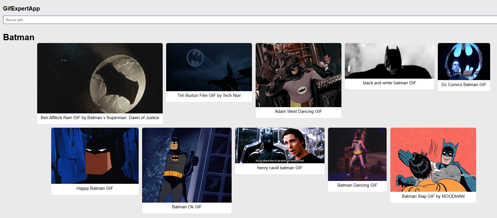

# 🖼️ Gif Expert

Aplicación de búsqueda de GIFs utilizando la API de [Giphy](https://giphy.com/), construida con **React**.

## 🚀 Demo

Accede a la app desplegada en GitHub Pages:  
👉 [https://ariascm.github.io/react-gif-expert](https://ariascm.github.io/react-gif-expert)

## 🛠️ Tecnologías utilizadas

- ⚛️ React (v18)
- 📦 Vite
- 🧪 Testing Library + Jest
- 🎨 CSS / Animaciones simples
- 🔍 API de Giphy

## 📷 Captura

## 📁 Estructura del proyecto

    src/
    ├── components/
    ├── helpers/
    ├── hooks/
    ├── tests/
    └── App.jsx

    
## ⚙️ Instalación

1. Clona el repositorio:

git clone https://github.com/ariascm/gif-expert.git

2. Instala las dependencias:

yarn install

3. Ejecuta la app en desarrollo:

yarn dev

## 🧪 Tests

Para ejecutar las pruebas unitarias:
yarn test

## 🧩 Funcionalidades

- Buscar GIFs por categoría
- Mostrar múltiples resultados simultáneamente
- Animaciones en la carga de imágenes
- Almacenamiento de historial de búsqueda

🧑‍💻 Autor
Creado por Cristian Arias como parte del curso de React de Fernando Herrera.
